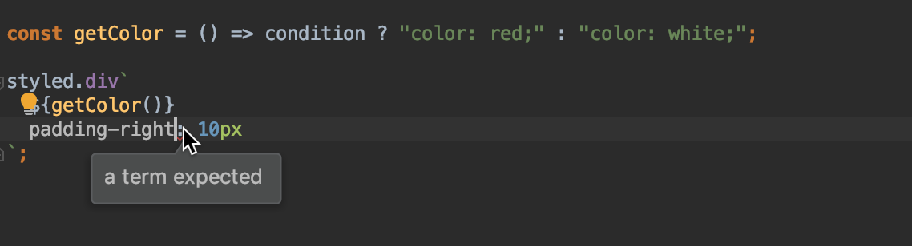

# webstorm-styled-components
Support for styled-components 💅 in WebStorm

The plugin can be installed in WebStorm, IntelliJ IDEA Ultimate, PhpStorm, PyCharm Pro, and RubyMine v2017.2 and above.

# Installation
To install the plugin open the IDE `Preferences | Plugins`, then click `Browse repositories...` and search for `Styled Components`.

# Features
With this plugin you can enjoy the full coding assistance for styled-components 💅

- Start typing to get code completion for CSS properties and values


- Hit <kbd>Alt</kbd>-<kbd>Enter</kbd> to see available intentions and quick-fixes


- Start typing in the interpolation to see completion suggestions for JavaScript variables, methods and functions


- Cmd/Ctrl-click on the JavaScript symbol to go to its definition

# Configuration
To configure additional tags, search for 'styled-components' in the IDE preferences, and enter any additional tags to treat as styled components.

For example, adding a value like `media` will enable CodeInsight for whose tag starts with it, e.g ``media.tablet`padding: 20px;` ``, ``media.desktop`padding: 10px;` ``.


# FAQ
- Why is code inside styled-components strings highlighted green?

The IDE highlights injected language fragments by default. The highlighting can be disabled in `Preferences | Editor | Color Scheme | General | Inejcted Language Fragment`.
- Why is code inside styled-components strings not reformatted?
 
 Formatting template strings with arguments is not currently supported by the IDE. Please follow this [IDE issue](https://youtrack.jetbrains.com/issue/WEB-28540) for updates.
- Why am I seeing syntax errors after a template argument?


The IDE's parser tries to determine what syntax element a template string argument replaces (property, value, etc). 
In some cases, it may be clear from code that at runtime the template argument will be a CSS property but not possible to infer the same statically:

```js
const getColor = () => condition ? "color: red;" : "color: white;";

styled.div`
  ${getColor()}
  padding-right: 10px
`;
```
In such cases, try placing a semicolon after the template argument:
```js
styled.div`
  ${getColor()};
  padding-right: 10px
`;
```

# Contributing to the plugin
Please report any issue with the plugin on [GitHub](https://github.com/styled-components/webstorm-styled-components/issues). We welcome your pull requests.

The plugin is written in [Kotlin](https://kotlinlang.org/) and uses [Gradle](https://gradle.org/).

**To start contributing**
1. Clone this repository.
2. Open the resulting directory in a recent version of Intellij IDEA (2017.*) using 'Open project'.
3. In the 'Import Project from Gradle' dialog, accept the default settings.

* To **run tests** use `test` task (from the IDEA UI search for 'Execute Gradle Task' and select `test` or run `./gradlew test` from the command line)

* To **launch IDEA** with the plugin built from your current sources use `runIde`

* To **prepare a zip archive** for deployment use `buildPlugin`

The project structure and dependencies are defined in [build.gradle](https://github.com/styled-components/webstorm-styled-components/blob/master/build.gradle).

**Useful links**
* [gradle-intellij-plugin](https://github.com/JetBrains/gradle-intellij-plugin) documentation on available Gradle tasks and build.gradle configuration options
* [IDEA SDK documentation](https://www.jetbrains.org/intellij/sdk/docs/basics/getting_started.html) describes IDEA plugin structure in general
* [Kotlin language reference](https://kotlinlang.org/docs/reference/) 

# License (MIT)
Copyright 2017 Hossam Saraya

Permission is hereby granted, free of charge, to any person obtaining a copy of this software and associated documentation files (the "Software"), to deal in the Software without restriction, including without limitation the rights to use, copy, modify, merge, publish, distribute, sublicense, and/or sell copies of the Software, and to permit persons to whom the Software is furnished to do so, subject to the following conditions:

The above copyright notice and this permission notice shall be included in all copies or substantial portions of the Software.

THE SOFTWARE IS PROVIDED "AS IS", WITHOUT WARRANTY OF ANY KIND, EXPRESS OR IMPLIED, INCLUDING BUT NOT LIMITED TO THE WARRANTIES OF MERCHANTABILITY, FITNESS FOR A PARTICULAR PURPOSE AND NONINFRINGEMENT. IN NO EVENT SHALL THE AUTHORS OR COPYRIGHT HOLDERS BE LIABLE FOR ANY CLAIM, DAMAGES OR OTHER LIABILITY, WHETHER IN AN ACTION OF CONTRACT, TORT OR OTHERWISE, ARISING FROM, OUT OF OR IN CONNECTION WITH THE SOFTWARE OR THE USE OR OTHER DEALINGS IN THE SOFTWARE.
